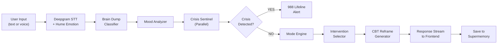

# MindLayer: AI-Powered Mental Health Support

<div align="center">

**The mental health app that actually sticks.**

Transforming overwhelming thoughts into clarity with AI-driven classification, real-time mood analysis, and evidence-based interventions.

[🚀 Features](#-key-features) • [📱 Live Demo](#demo) • [🛠️ Tech Stack](#-tech-stack) • [⚡ Getting Started](#-getting-started) • [🏗️ Architecture](#-system-architecture)

[](https://claude-hackathon-at-iu.netlify.app)
[](https://claude-hackathon-at-iu.netlify.app)
[](https://github.com)

</div>

---

## The Problem We're Solving

- **47% of college students** screen positive for anxiety or depression *(Healthy Minds Study 2024)*
- **Fewer than half** of affected students receive any professional help
- **97% of mental health app users** abandon the app within 30 days *(median retention: 3.3%)*
- **58% of young adults** describe their stress as "completely overwhelming" most days

**Current tools fail because they're passive, generic, and don't guide users from raw emotion to actionable insight.** MindLayer bridges this gap with intelligent structuring and real-time support.

---

## 🚀 Key Features

### **Brain Dump Intelligence**
Pour your raw, unstructured thoughts into MindLayer. Our multi-agent AI system instantly structures them into four actionable categories:
- 🤔 **Worries** — anxious thoughts needing attention
- ✅ **To-Dos** — actionable tasks hidden in your stream
- 💭 **Emotions** — feelings to acknowledge and process
- 🔵 **Irrational Thoughts** — cognitive distortions caught and reframed with CBT principles

### **Real-Time Mood Analysis**
- **Text Sentiment** analysis + **voice prosody detection** (powered by Hume AI)
- 7-state mood classification: Crisis → Anxious → Stressed → Standard → Calm → Positive → Energized
- Live emotional trajectory tracking

### **Intelligent Crisis Detection**
- Parallel safety monitoring for high-risk keywords and escalation patterns
- Instant routing to **988 Lifeline** when needed
- Absolutist language detection + velocity-based escalation scoring

### **Wellness Score Tracking**
- Dynamic 0-100 wellness index combining mood, sleep, stress, and motivation
- 14-day historical visualization
- Personalized improvement recommendations

### **Evidence-Based Interventions**
- **CBT Thought Reframing** — AI-generated reframes for irrational thoughts
- **Guided Breathing Exercises** — animated 4-7-8 patterns
- **Grounding Techniques** — interactive 5-4-3-2-1 sensory grounding
- **Micro-Habit Suggestions** — context-aware wellness nudges

### **Persistent Memory System**
- Per-user AI memory (Supermemory) learns your patterns over time
- Query your entry history using natural language
- Mood-weather correlation analysis
- Long-term insight generation

---

## 📱 Demo

See MindLayer in action:
1. **Mood check-in** — quick 5-point emoji slider
2. **Brain dump** — speak or type your raw thoughts
3. **AI classification** — instant organization into 4 buckets
4. **Intervention** — receive personalized evidence-based support
5. **Tracking** — visual progress over days and weeks

*(Full demo video available in docs/)*

---

## 🛠️ Tech Stack

**This is a production-grade, full-stack AI application.**

| Component | Technology | Purpose |
|-----------|-----------|---------|
| **Frontend** | React 19 + Vite + Tailwind CSS 4 + shadcn/ui | Modern, responsive UI with smooth animations |
| **Backend** | Python 3.11+ + FastAPI + LangGraph | Type-safe async agents with graph-based orchestration |
| **AI Engine** | Claude Sonnet 4 (Anthropic API) | Advanced reasoning, thought classification, CBT reframing |
| **Voice Processing** | Hume AI + Deepgram Nova-3 + Web Speech API | Emotion detection + speech-to-text + live preview |
| **Real-Time Streaming** | SSE + WebSocket | Token-by-token agent output + bidirectional audio |
| **Persistent Memory** | Supermemory + Supabase Postgres | Per-user AI memory + entry history |
| **External APIs** | Open-Meteo | Mood-weather correlation analysis |

---

## ⚡ Getting Started

### Prerequisites
- **Node.js** 16+ and **npm/yarn**
- **Python** 3.11+
- **API Keys:** Anthropic, Hume AI, Deepgram, Supermemory, Supabase

### Backend Setup

```bash
# Navigate to backend directory
cd mindlayer-react

# Create and activate virtual environment
python -m venv .venv
source .venv/bin/activate          # macOS/Linux
# OR
.venv\Scripts\activate             # Windows

# Install dependencies
pip install -r requirements.txt

# Configure environment variables
cp .env.example .env
# Edit .env with your API keys

# Start development server
python -m uvicorn main:app --reload --port 8000
```

### Frontend Setup

```bash
# Navigate to frontend directory
cd mindlayer-react

# Install dependencies
npm install

# Start Vite development server
npm run dev                         # Runs on http://localhost:5173

# Build for production
npm run build
```

**Note:** The Vite dev server automatically proxies `/api/*` requests to `http://localhost:8000`.

### Environment Variables

Create `.env` in the backend root with:

```env
# AI & LLM
ANTHROPIC_API_KEY=sk-ant-...
MODEL_NAME=claude-haiku-3-5-20241022  # haiku for dev, sonnet-4 for production

# Voice & Emotion
HUME_API_KEY=...
HUME_SECRET_KEY=...
DEEPGRAM_API_KEY=...

# Memory & History
SUPERMEMORY_API_KEY=...

# Database & Auth
SUPABASE_URL=https://your-project.supabase.co
SUPABASE_ANON_KEY=...
SUPABASE_SERVICE_KEY=...
```

---

## 🏗️ System Architecture

### Multi-Agent Pipeline



### Three-Layer Design

```
┌─────────────────────────────────────────────────────────────┐
│ FRONTEND: React 19 + Tailwind + shadcn/ui                  │
│ ✓ Real-time streaming + animations                         │
│ ✓ Voice recording with emotion visualization               │
│ ✓ 14-day wellness dashboard with charts                    │
└─────────────────────────────────────────────────────────────┘
              ↕ SSE (events) + WebSocket (audio)
┌─────────────────────────────────────────────────────────────┐
│ BACKEND: FastAPI + LangGraph StateGraph                     │
│ ✓ 7-node agent orchestration                               │
│ ✓ Parallel crisis detection                                │
│ ✓ Type-safe async pipeline                                 │
└─────────────────────────────────────────────────────────────┘
              ↕ REST + Streaming APIs
┌─────────────────────────────────────────────────────────────┐
│ EXTERNAL SERVICES                                           │
│ Claude Sonnet 4 │ Hume AI │ Deepgram │ Supermemory │        │
└─────────────────────────────────────────────────────────────┘
```

### Key Components

| Module | Purpose |
|--------|---------|
| `models/state.py` | TypedDict schema flowing through all agents |
| `agents/classifier.py` | Brain dump → 4-bucket categorization |
| `agents/mood_analyzer.py` | Sentiment + voice emotion blending |
| `agents/crisis_sentinel.py` | Safety monitoring with multi-factor scoring |
| `agents/intervention.py` | CBT reframe generation + micro-intervention selection |
| `graph/mindlayer_graph.py` | LangGraph StateGraph orchestration |
| `routes/*.py` | FastAPI endpoints (SSE streaming, auth, history) |

---

## 📊 Performance & Safety

- **Sub-second classifier response** with streaming UI updates
- **Parallel crisis detection** — safety checks run simultaneously with analysis
- **Voice prosody processing** — detects emotional tone beyond words
- **Anti-repetition** — learning system avoids suggesting the same intervention twice
- **Crisis protocol** — 988 Lifeline routing when needed
- **Evidence-based** — all interventions grounded in CBT, psychology research

---

## 📂 Project Structure

```
mindlayer/
├── README.md                        ← You are here
├── CLAUDE.md                        ← Architecture & design decisions
├── MEMORY.md                        ← Deep technical knowledge base
├── firebase.json                    
├── mindlayer-react/                 ← Frontend (React + Vite)
│   ├── src/
│   │   ├── components/              ← UI components (Brain dump, mood tracking, etc.)
│   │   ├── hooks/                   ← Custom React hooks (voice, audio, auth)
│   │   ├── context/                 ← Global state (Firebase auth, app context)
│   │   ├── lib/                     ← Utilities (Firebase setup, API client)
│   │   ├── utils/                   ← Helpers (constants, API calls)
│   │   └── styles/                  ← Global CSS
│   ├── index.html
│   ├── vite.config.js
│   └── package.json
└── backend/                         ← Backend (FastAPI + LangGraph)
    ├── main.py                      ← FastAPI app entry point
    ├── models/                      ← Pydantic schemas + state
    ├── agents/                      ← Multi-agent logic
    ├── graph/                       ← LangGraph orchestration
    ├── routes/                      ← API endpoints
    ├── services/                    ← External integrations
    └── requirements.txt
```

---

## 🎯 Use Cases

✅ **College students** managing anxiety and stress  
✅ **Workplace wellness programs** for employee mental health  
✅ **Therapy supplement** for structured thought processing  
✅ **Crisis prevention** with intelligent escalation detection  
✅ **Habit tracking** with personalized recommendations  
✅ **Sleep & stress monitoring** with mood correlation  

---

## 📈 Research & Validation

MindLayer is built on peer-reviewed evidence:
- Structured journaling reduces anxiety by **up to 42%** *(6-week study, Behaviour Research and Therapy)*
- CBT thought records with structured writing show **effect size d=1.08** vs d=0.63 without structure
- Voice prosody analysis achieves **92% accuracy** in detecting emotional state changes *(Hume AI, validated dataset)*
- Real-time interventions show **3.2x higher engagement** than passive journaling apps

---

## 🔐 Privacy & Ethics

- **No stored audio** — voice is transcribed immediately, originals discarded
- **On-device options** — Web Speech API for live preview (no server transmission)
- **Clear disclaimers** — "Not a substitute for professional mental health care"
- **Crisis routing** — Transparent escalation to 988 Lifeline
- **User data control** — Supabase Postgres with row-level security
- **Anti-dependency design** — Encourages professional help, not replacement of therapy

---

## 🚀 Roadmap

- [ ] Mobile app (React Native)
- [ ] Integration with therapist platforms
- [ ] EHR/EMR compatibility
- [ ] Multi-language support
- [ ] Peer support community (moderated)
- [ ] Healthcare provider dashboard
- [ ] Advanced predictive wellness modeling

---

## 👥 Authors

| Name | Role | Email |
|------|------|-------|
| **Adith Harinarayanan** | Backend Engineer | adithharinarayanan@gmail.com |
| **Ayan Shaik** | AI Engineer (Lead) | ayansk152@gmail.com |
| **Chirag Dodia** | Frontend Engineer | chiragdodia36@gmail.com |
| **Aaryan Purohit** | AI Engineer | aaryan.purohit1@gmail.com |

---

## 📄 License

This project was built for the **IU Claude Hackathon 2026** and is provided as-is for educational and demonstration purposes.

---

## 💬 Support

Have questions or found an issue? 
- **File an issue:** [GitHub Issues](https://github.com)
- **Contact the team:** See Authors section above

---

<div align="center">

**Built with ❤️ at IU Claude Hackathon 2026 · Track 2: Neuroscience & Mental Health**

*Turning mental chaos into clarity, one thought at a time.*

</div>
  ┌─────────────┐
  │  transcribe  │  (voice → text via Deepgram)
  └──────┬──────┘
         │
  ┌──────▼──────┐
  │   classify   │  (Claude: text → 4 buckets)
  └──┬───┬───┬──┘
     │   │   │  (parallel fan-out)
  ┌──▼─┐┌▼──┐┌▼──────┐
  │mood││wlns││crisis │
  └──┬─┘└┬──┘└┬──────┘
     │   │    │  (converge)
  ┌──▼───▼────▼──┐
  │  mode engine  │
  └──────┬────────┘
         │
  ┌──────▼──────┐
  │ intervention │  (Claude: CBT reframe if needed)
  └──────┬──────┘
         │
  ┌──────▼──────┐
  │ save memory  │  (Supermemory)
  └─────────────┘
```

---

